# Last Bell

[](https://pypi.org/project/lastbell/)
[](https://pypi.org/project/lastbell/)
[](https://github.com/noestudios/lastbell/actions/workflows/ci.yml)
[](LICENSE)

**Find out about the missing assignment the day the teacher flags it, not
the night before report cards.**

Last Bell watches your own students' ParentVUE gradebook and their Canvas
coursework from a computer you control, and tells the people who should
know, guardians and the students themselves, by email or push, in a
message safe enough for a lock screen. It runs on a Raspberry Pi, a NAS, or
the laptop that never sleeps. Free, open source, no account, no company in
the middle: your credentials and your kids' data stay on a computer you own.

> Not affiliated with Edupoint (ParentVUE / Synergy) or Instructure (Canvas).
> Built and verified against Montgomery County Public Schools (MCPS). It should
> work anywhere the Synergy PXP2 web portal runs ([check your district](#does-it-work-outside-mcps)).

**What it tells you**

- **Missing work** the moment Canvas or the gradebook says so.
- **Due soon**, everything due in the next 7 days, before it's late.
- **Grades posted** and **grade drops** past a threshold you set.
- **Still ungraded** past the due date, the quiet kind of missing.
- **Finals** when a marking period closes, once, then a clean start.

Delivered per person: Mom gets everything in a 4pm digest with the urgent
items sent right away; the student gets nudges about deadlines and missing
work but no grades; Grandma gets a morning summary. Nobody logs into anything
to receive it.

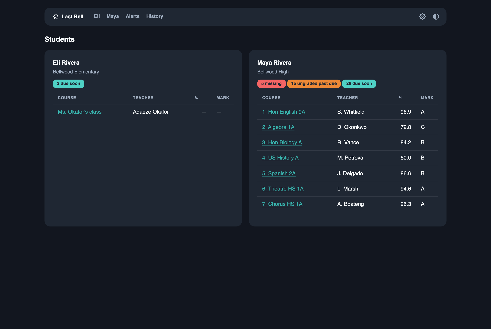

<p align="center">
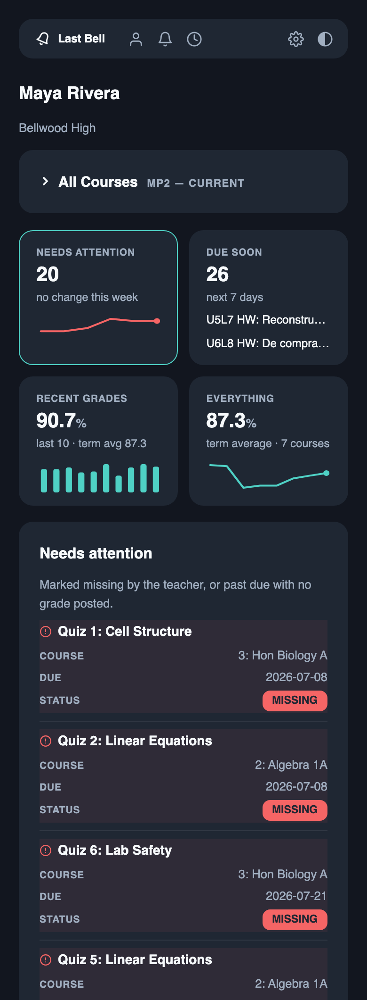
&nbsp;&nbsp;
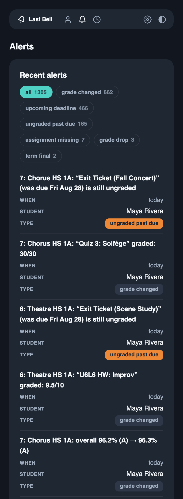
</p>

*Every screenshot is from `lastbell seed-demo`, a fabricated family at
end-of-quarter volume, no real students. [More screenshots below.](#a-tour-of-the-dashboard)*

**[Click through the demo](https://noestudios.github.io/lastbell/)**: the
same fabricated family as a site, nothing to install.

---

## Questions worth asking first

### Who is this for?

A parent or guardian with a student in a district that runs ParentVUE, who
would prefer to have an easy-to-use dashboard and regular reminders, and
who has (or can borrow) a computer that stays on. You need to be
comfortable pasting three commands into a terminal. That's the whole bar;
the setup wizard does the rest.

### Where does my password go?

Into your operating system's keyring and, at poll time, to your district's
own login form over HTTPS. It isn't written to a settings file, the database,
a log, or anywhere on the internet. The one exception is an always-on box
with no usable keyring, such as a headless Pi, where the wizard explains the
trade-off and does nothing until you say yes.
[Exactly where it goes, with code links.](#credentials--student-data-the-actual-guarantees)

### Where does my kids' data go?

Nowhere. Snapshots, history, and alerts live in a SQLite file on the machine
running Last Bell. The only outbound traffic is to your district's portal
and Canvas, to the alert channels you configure, and to PyPI when you click
**Check for updates**. What leaves is what you route, and alert messages
carry a child's initials rather than a full name.
[The full list, with code links.](#credentials--student-data-the-actual-guarantees)

### Will the school notice? Is this allowed?

Last Bell's traffic looks like what it is: one parent checking the gradebook
a few times a day. Eight polls a day by default, with a 15-minute floor
enforced in code, each one loading the same pages you would by clicking
through your classes by hand. Portal terms vary by district and vendor and
are yours to judge; [the entire footprint is listed](#being-a-good-neighbor-to-the-portal)
so you can. For Canvas it uses the same observer-scoped API as the official
Canvas Parent app, [within Instructure's policies](#canvas-the-leading-source).

### Why Canvas too? I thought ParentVUE was the gradebook.

It is — but it's the *trailing* one. Teachers flag work missing in Canvas,
and the gradebook only sees it when the teacher syncs, often days later. So
**Needs attention** and **Due soon** come from Canvas first, and ParentVUE
keeps the course grades and the finals. No second password is involved.
[How the two are merged.](#canvas-the-leading-source)

### Does it work outside MCPS?

Probably, if your district runs the Synergy PXP2 web portal. One command
gives you a go/no-go without installing anything: pipx fetches Last Bell,
runs the check, and keeps nothing.

```bash
pipx run lastbell preflight --district your-host.example --username you --report
```

Leave off `--username` for an anonymous check that sends no credentials
anywhere.

It prints a verdict and a redacted report you can paste into a district-report
issue so the parsers can be taught your district.
[What it checks, and how to file the report.](#the-district-preflight)

### Why isn't this a phone app?

Because a phone can't do the job. Last Bell's whole value is checking every
few hours, and phones don't let apps run in the background on a schedule.
Something always on has to do the watching — a Pi, a NAS, an old laptop.
The dashboard is built for a phone screen (no separate app), and the `ntfy`
and Pushover channels deliver real push notifications to one.

### Why no text messages?

On purpose. The carriers' free email-to-text gateways are gone or going
(T-Mobile's shut down in December 2024, AT&T's in June 2025, Verizon's is
being retired by March 2027 and already drops messages silently). A channel
that reaches some people and never reaches others is worse than none, so a
gateway address is refused at entry with that explanation. Email works
everywhere; `ntfy` is free push if you want it on a lock screen.

### Can my kid get the alerts too?

Yes. Students are watchers like anyone else, and
subscriptions are filtered by alert type, so a student typically gets
missing-work and deadline nudges and no grades. The people being watched
are on the watcher list.

### What do I need?

- A computer that stays on: Raspberry Pi, NAS, Mac, Linux box, or Windows
  machine. It becomes a background service with one command.
- Python 3.9 or newer and [pipx](https://pipx.pypa.io/stable/how-to/install-pipx.html)
  — or Docker, if the box already runs it (see *Run it as a container*).
- An email account it can send from (any SMTP account you own). The wizard
  asks for it and sends a test.

### What does it cost?

It costs nothing and is MIT licensed. Email rides your own account; `ntfy` is
free; Telegram and Pushover are optional.

### What happens when it breaks?

You hear about it. One failed poll just waits for the next cycle. When the
failure lasts (two polls for a rejected sign-in, a day for an unreachable
portal), every guardian gets one message on their own channels saying
what is wrong and what to do, and one more when checking resumes. The
home page footer names the failure meanwhile. While the portal is
rejecting the sign-in, the poller slows to once a day so a stale password
can't lock the account. If the portal changes shape, `lastbell preflight`
tells you which parser stopped understanding what, in a redacted report
you can file as an issue. If Canvas is unreachable, the gradebook still
gets checked.

If the whole machine stops, because the Pi lost power or the SD card died,
nothing can email you from a box that is off. For that there is a
heartbeat: point `LASTBELL_HEARTBEAT_URL` at a free
[healthchecks.io](https://healthchecks.io) check or an Uptime Kuma push
monitor, and Last Bell fetches it after every successful poll. That
service raises the alarm when the pings stop.

When you want to see for yourself, `lastbell status` puts it on one
screen: which version is running and whether a newer one is installed but
not yet restarted, whether the service is running, when the last
successful check was and when the next is due, who is subscribed to whom,
and where the password lives (never the password itself). Students appear
as initials and home directories as `~`, so the output can go straight
into an issue.

### How do I remove it?

```bash
lastbell forget
```

It lists what it will remove (the background service, the database with
every snapshot and alert, the settings file, the keyring entries), asks,
and does it. Then `pipx uninstall lastbell` removes the program.

---

## Quickstart

Three commands, no files to edit. First get
[pipx](https://pipx.pypa.io/stable/how-to/install-pipx.html) (macOS: `brew install pipx`,
Windows: `py -m pip install --user pipx`, Debian/Ubuntu: `sudo apt install pipx`),
then:

```bash
pipx install lastbell
```

```bash
lastbell setup
```

```bash
lastbell run --loop
```

`lastbell setup` is an interactive wizard: it confirms your district's portal
(MCPS offered as the default) before asking anything personal, puts your
password straight into the OS keyring, verifies login + data path + parsers
with the preflight, walks you through one notification channel (email; ntfy
push for the terminal-minded) ending in a live test message, offers to run
the first collection, and offers to install itself as a background service
so the third command above becomes optional. Re-run it any time. It
remembers your answers. Settings land in your user config dir, data in your
user data dir (both printed at the end).

**Keeping it running.** Alerts only happen while `lastbell run --loop` is
running, so on the machine that will do the watching:

```bash
lastbell install-service
```

Linux gets a *user* systemd unit (no sudo) enabled at boot with login
lingering, so it runs with nobody logged in; macOS gets a launchd agent that
starts at login and restarts if it stops; Windows is shown the Task Scheduler
command to paste. `--print` shows exactly what would be written and run
without touching anything, `--uninstall` reverses it. On a Pi that boots
without a desktop session, say **yes** when `lastbell setup` asks whether Last
Bell will run as a background service. That moves the password from the
keyring (which a boot-time service can't unlock) into the owner-only settings
file, and the wizard says so before doing it. The installer also warns if the
box's clock is on UTC: digests and quiet hours follow the local clock.

**Upgrading.** The dashboard footer's **Check for updates** link tells you
when a newer release exists. Then, on the machine running it:

```bash
lastbell upgrade
```

That runs `pipx upgrade lastbell` and, when it installed something newer
(or an earlier upgrade was never followed by a restart), restarts **both**
long-running copies, the poller and the dashboard, which each keep the old
version in memory until restarted. When nothing changed it says "nothing to
restart" and leaves them alone; `lastbell upgrade --restart-only` restarts
them regardless. On Linux the restart is the two user units; on macOS the
launchd agent, with a reminder about the dashboard. By hand, the same thing
is `pipx upgrade lastbell`, then `systemctl --user restart lastbell` (plus
`lastbell-dashboard` if you set that up) on Linux, or `lastbell
install-service` again on macOS. The dashboard footer flags "installed —
restart to use it" until its own process has been restarted.

**Backing up.** One command, one file:

```bash
lastbell backup
```

The zip holds the database, copied through SQLite's own backup API so a copy
taken mid-poll is still whole, and the settings file with every secret left
out: the portal and SMTP passwords, channel tokens, the dashboard key. It is
written owner-only and still holds names and grades, so keep it somewhere
private. `lastbell restore <file>` brings it back on a fresh install. It
refuses to replace an existing database unless told `--force` (and then keeps
the old one beside it), merges settings without touching the secrets already
there, and reminds you to store the password again with `lastbell setup` or
`lastbell set-password`.

### Run it as a container

Already running Docker — on a NAS, a home server, a Pi with Portainer? Then
Python and pipx aren't needed: every release is also a container image,
`ghcr.io/noestudios/lastbell`, built by the same tag from the same wheel,
for `linux/amd64` and `linux/arm64` (a 64-bit Raspberry Pi). Put
[`docker-compose.yml`](docker-compose.yml) in an empty folder (on Linux,
`mkdir -p data` there too, so the folder is yours and not root's) and run
three commands:

```bash
docker compose run --rm lastbell setup
```

```bash
docker compose up -d
```

```bash
docker compose exec dashboard lastbell dashboard --show-key
```

The first is the same wizard as above, in a throwaway container: it takes
the settings-file path without asking about keyrings (an image has none),
runs the preflight and the first collection, and skips the service step —
Docker is the service. The second starts the poller and the dashboard and
keeps them running across reboots. The third prints the link to open once:
inside a container even your own browser arrives over the Docker bridge, so
the dashboard asks for its key one time and then remembers the browser.

**The volume.** `./data` is mounted as `/data`, and that is everything: the
database, the snapshots, and the settings file the wizard wrote (`data/env`,
owner-only — the password is in it, in plain text, the same trade-off an
always-on Pi makes, because the image has no keyring). Back it up by backing
up the folder, or `docker compose exec lastbell lastbell backup` writes the
usual zip into it. The image runs as an unprivileged user with id 1000; if
the containers can't write to `data/` — the usual NAS symptom, and the
wizard says so — hand the folder over once: `sudo chown -R 1000:1000 data`.

**Upgrading.** Two commands, in the folder with `docker-compose.yml`:

```bash
docker compose pull && docker compose up -d
```

Compose restarts only the containers whose image changed. `lastbell
upgrade`, `lastbell status`, and `lastbell install-service` know when they
run in a container and say this instead of looking for pipx or systemd, and
the footer's "restart to use it" badge never appears there, because the
image is the only copy. To pin a release instead of following `latest`,
change the two `image:` lines to `ghcr.io/noestudios/lastbell:X.Y.Z`.

**Reaching it by name.** The compose file publishes the dashboard on the
host's loopback only (`127.0.0.1:8321`). To open it from other devices,
widen that line to `8321:8321`; and if you reach the host by a name (a NAS
name, home DNS) list it in the one line under the dashboard service —
`LASTBELL_DASHBOARD_HOSTNAMES: nas.home.arpa` — because the dashboard
refuses names it doesn't recognize (see *The dashboard*, below). Set `TZ`
in the compose file to your own time zone: digests and quiet hours follow
it. Packaged apps for Umbrel, Home Assistant, and NAS app stores come later;
this image is what they will wrap.

<details>
<summary>Running from a source checkout instead</summary>

```bash
python3 -m venv .venv && source .venv/bin/activate
pip install -e .

cp .env.example .env          # then edit: district + username (NOT the password)
lastbell set-password       # stores the password in your OS keyring
lastbell preflight          # district go/no-go check (values redacted)

lastbell run                # one pass: snapshot, diff, alert (first run = baseline)
lastbell run --loop         # keep polling every LASTBELL_POLL_MINUTES
lastbell collect            # read-only JSON dump of what a run would persist
```

A checkout's `.env` (in the working directory) takes precedence over the
installed settings file, and typically pins `LASTBELL_DB_PATH=data/lastbell.db`
to keep state inside the repo tree. The `Dockerfile` is the one each release
builds the published image from (*Run it as a container*, above); to build it
from the working tree instead, uncomment the `build: .` lines in
`docker-compose.yml` and `docker compose build`. `LASTBELL_PASSWORD_FILE` (a
Docker secret) is still honored for anyone who would rather not keep the
password in `data/env`.
</details>

## The dashboard

Everything after setup happens in the dashboard. `lastbell dashboard` serves
it at http://127.0.0.1:8321: students, assignments, grade history, the alert
log, and a **Settings** page where you add the people who should hear about
each student, give each an email address, pick which alert types they get,
and set quiet hours. Every address row has a **test** button that sends the
same one-line message the wizard did, so "does this actually reach Grandma's
phone?" is one click. The footer shows the version you're running and a
**Check for updates** link that asks PyPI, on that click only, whether a
newer release exists.

It listens on `127.0.0.1` only. `--host 0.0.0.0` (or
`LASTBELL_DASHBOARD_HOST`) opens it to the rest of the house, and then two
things apply. **A key.** Requests from the machine itself need nothing;
every other device needs the dashboard's key once. The dashboard generates
a long random one on first start, keeps it in the settings file, and prints
a link like `http://raspberrypi.local:8321/?key=…`. Open that link on a
phone and its browser is remembered; anything without the key gets a page
asking for it. `lastbell dashboard --show-key` prints the link again. **A
name check.** It answers only to names it recognizes: localhost, IP
addresses, `.local` names, the bound address, and anything you list in
`LASTBELL_DASHBOARD_HOSTNAMES`; a request addressed to any other hostname
gets a refusal page explaining why. That is what stops a web page you
happen to visit from reaching the dashboard through your own browser (DNS
rebinding).

The dashboard speaks plain HTTP, so the key crosses the network in the
clear. On a home network or over Tailscale that is fine. On the public
internet it is not: binding to a public address is refused, and the right
shape there is loopback behind a TLS reverse proxy that does its own login.

You start with one watcher automatically: the first run creates a guardian
named after the credential holder, subscribed to every student, on the
considerate default of one daily digest at 4pm, with urgent alert types
(missing assignment, upcoming deadline, grade drop) sent immediately. Rename
or remove it freely.

Want to see it populated before pointing it at your own kids? `lastbell
seed-demo` fabricates a fake family at end-of-quarter volume (two marking
periods, hundreds of assignments, months of history, no real student data)
and `lastbell dashboard --db <path it prints>` serves it.

### A tour of the dashboard

**The four tracking cards.** A student's page is a set of views, and the
cards are both the summary and the switch:

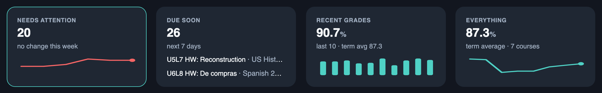

- **Needs attention.** Work the teacher marked missing, plus anything
  past due with no grade posted. The count, this week's change, and a
  six-week trend line, so a bad week and a slow slide look different.
- **Due soon.** What's coming in the next 7 days (`LASTBELL_LOOKAHEAD_DAYS`),
  with the next two named right on the card.
- **Recent grades.** The average of the last ten scores, shown as bars
  against the term average: the fastest read on how things are going
  *right now*, before it moves the course grade.
- **Everything.** The term average across all courses and its trend, and
  the door into the full archive: every class, every assignment, closed
  terms folded to their finals.

<details>
<summary>More screens: student page, Needs attention, Alerts, History, Settings</summary>

**A student's page.** The All Courses strip collapsed (the default; the
cards are the front door) and expanded (grade, two-week movement, open
items, last graded). Each course name filters the view below to that class:

<p>
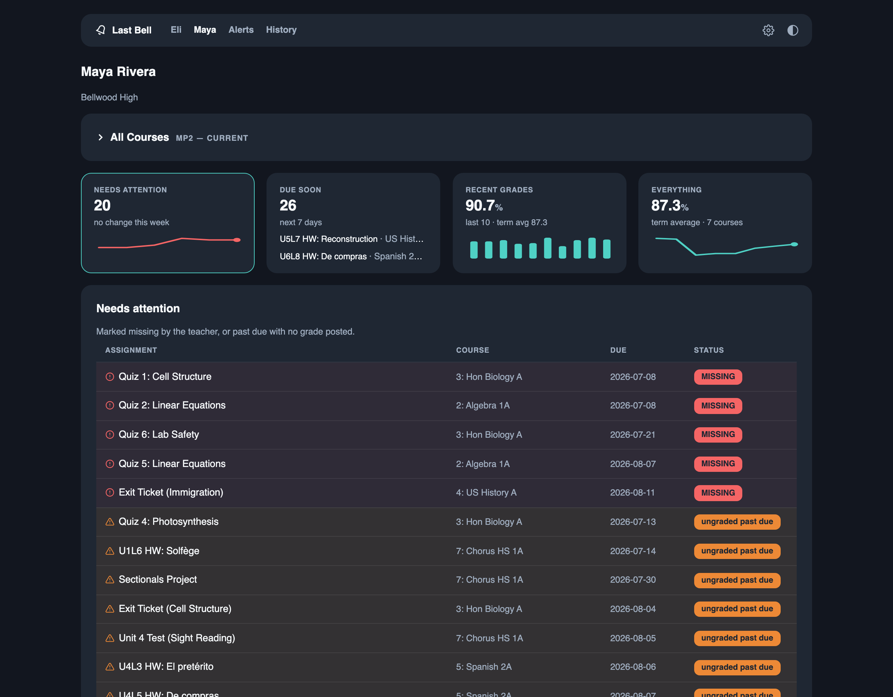
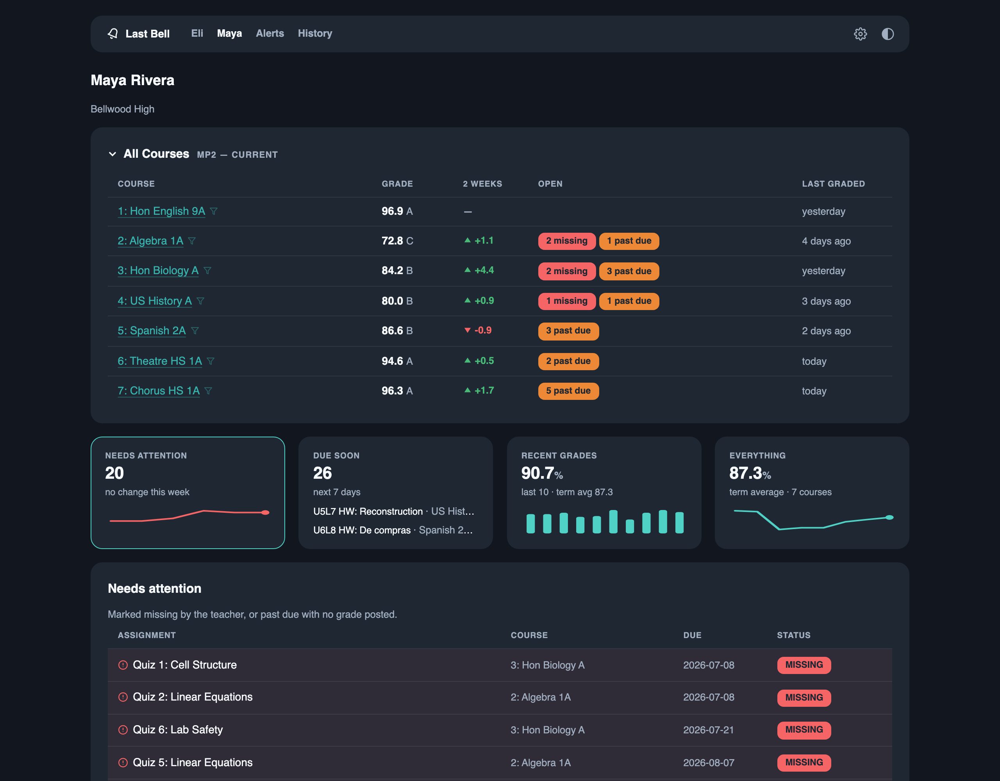
</p>

**Needs attention.** The default view: missing work first, then ungraded
past-due, each row tinted and iconed so the list scans by color before
it's read.

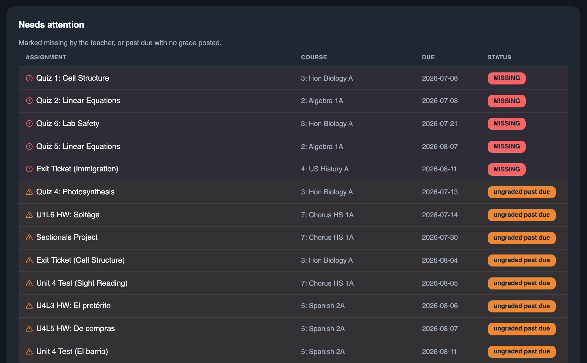

**Alerts and history.** Alerts is everything a watcher was told about,
grouped by type and paged; History is every grade and status change ever
seen, filterable by class and by kind of change.

<p>
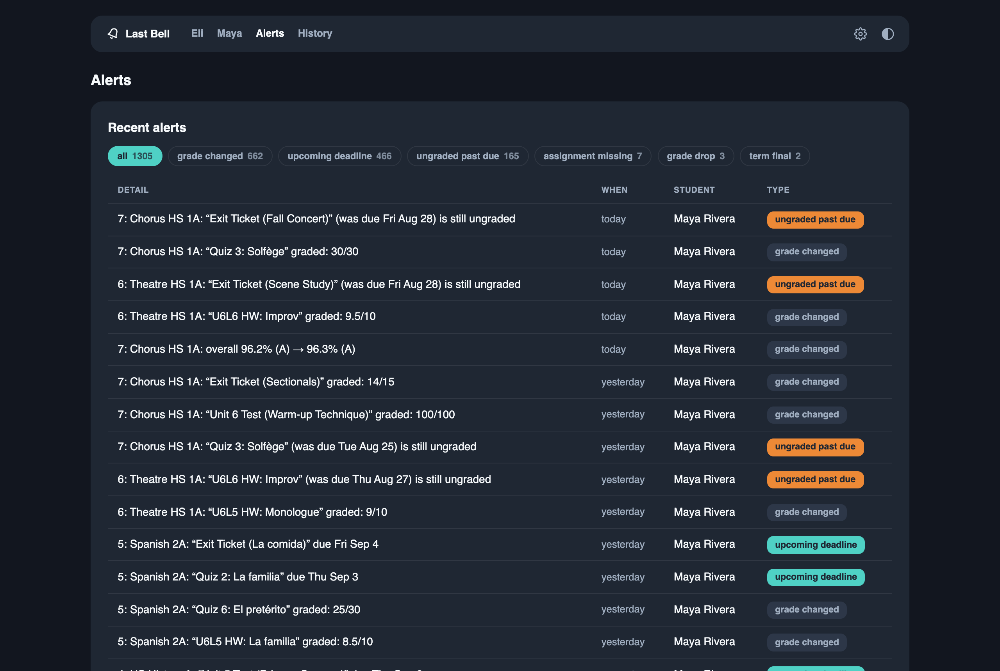
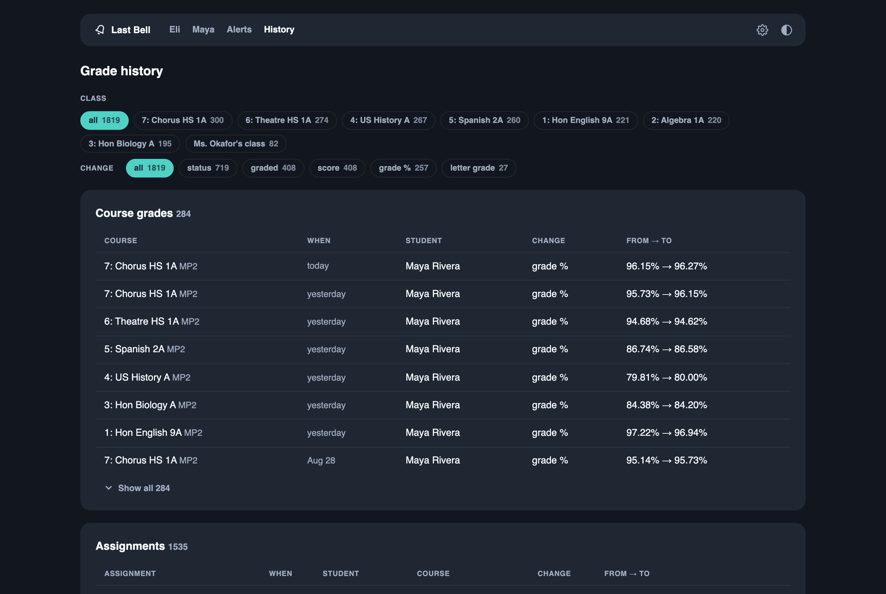
</p>

**Settings.** Watchers (guardians *and* students) with their channels,
and subscriptions: who hears about which student, over which channel,
immediately or in a daily digest, with the urgent types allowed through
right away.

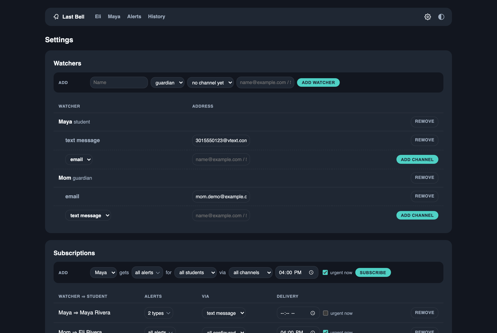
</details>

## How alerts reach people

Push-**out**, not pull-in: nobody signs into Last Bell to receive an alert.
A *watcher* is just a name plus addresses; *subscriptions* say which student's
events reach them, over which channels, filtered by alert type. One poll means
one message per watcher-channel, so a watcher subscribed to three alert types
gets a single message listing everything.

Email goes out over STARTTLS (or implicit TLS on port 465) with the mail
server's certificate verified against the OS trust store. It carries an
HTML version next to the plain text: updates grouped by
what they mean (Needs attention, Slipping, Coming up, Grades posted), the
course above the assignment, and a *Canvas* pill where the work came from
Canvas. The daily summary gets an Overall table
([`notify/render.py`](https://github.com/noestudios/lastbell/blob/main/lastbell/notify/render.py)).
Subjects count by kind: `[Last Bell] J.P.H.: 1 missing, 2 due soon`. Push
channels get the same grouping as text. `lastbell watcher test NAME --sample`
sends a realistic sample with made-up courses.

<p>
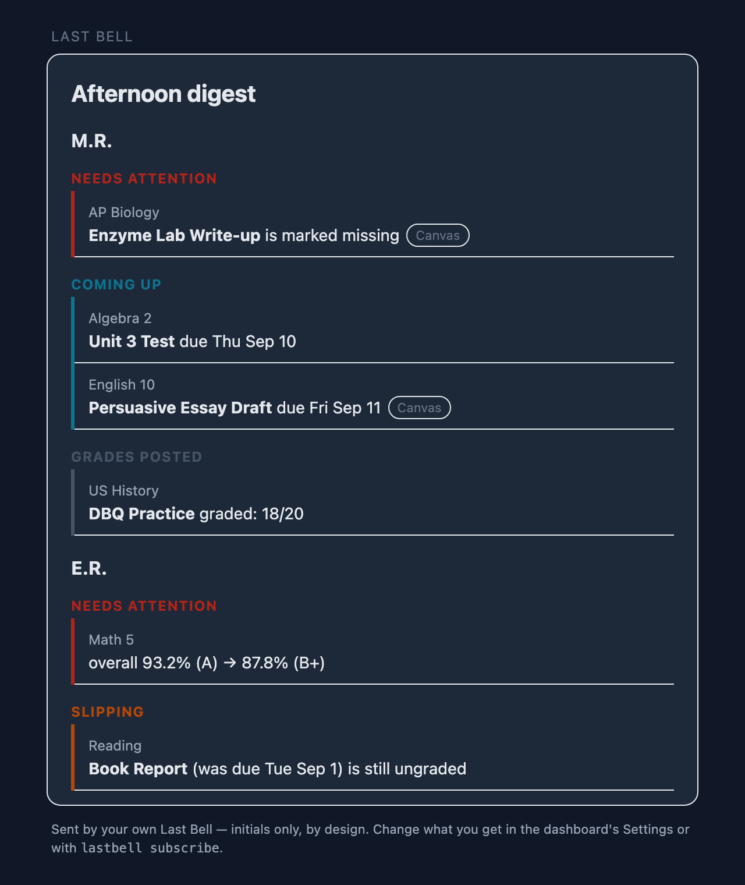
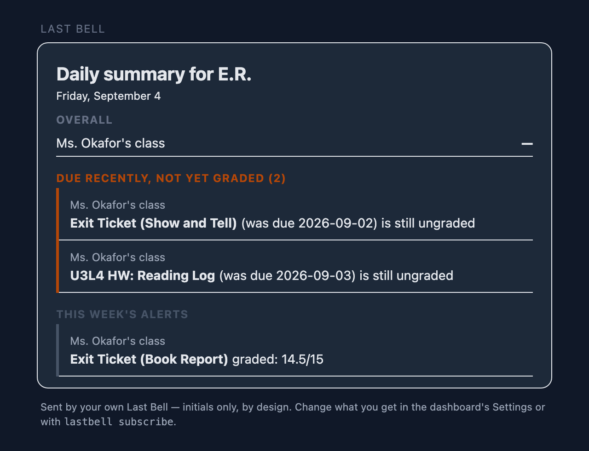
</p>
<p>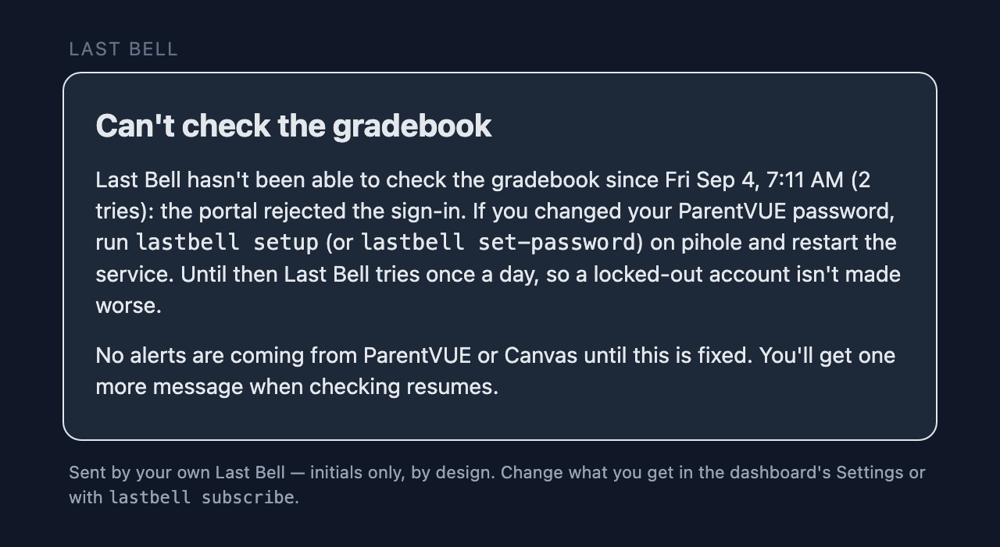</p>

*Left to right: an afternoon digest, a morning summary, and the one message
guardians get when checking stops.*

| Channel    | Where it goes                                   | Setup                                        |
|------------|-------------------------------------------------|----------------------------------------------|
| `email`    | any inbox                                       | `LASTBELL_SMTP_*`: any email account you own; `lastbell setup` asks |
| `ntfy`     | the free ntfy app (terminal-only)               | none (public ntfy.sh) or `NTFY_SERVER/TOKEN` |
| `telegram` | a Telegram chat (terminal-only)                 | `LASTBELL_TELEGRAM_TOKEN` (@BotFather bot)   |
| `pushover` | the Pushover app (terminal-only)                | `LASTBELL_PUSHOVER_TOKEN` (app token)        |
| `console`  | the run's stdout                                | none                                         |

The wizard and the dashboard offer email; the other three stay available
from `lastbell watcher`. Know your transports: `email` rides your own SMTP
account; `ntfy` posts to the public ntfy.sh unless you self-host, and **the
topic name is the only secret** there, so make it long and random; `telegram`
and `pushover` go through those services' APIs.

In `run --loop`, the portal is polled every `POLL_MINUTES` but the outbox and
summaries are checked **every minute**, so a 17:00 digest goes out at 17:00,
not at the next three-hour poll. Time-based deliveries use the host's local
clock. An event subscribed both immediately and in a digest is sent once,
immediately. A summary reports *standing state* (overall marks, missing work,
what's due soon, the week's recent alerts); a digest batches the *events* that
fired.

<details>
<summary>Doing it from the terminal instead</summary>

Everything the Settings page does has a command, plus the three channels the
dashboard doesn't offer:

```bash
lastbell watcher add Mom --kind guardian --channel email=mom@example.com
lastbell watcher add Jasper --kind student --channel ntfy=some-long-secret-topic
lastbell subscribe Mom jasper                 # all alert types, all her channels
lastbell subscribe Jasper jasper \
    --types assignment_missing,upcoming_deadline    # students see nudges, not grades
lastbell subscribe Mom jasper --at 17:00      # batch her alerts into a 5pm digest
lastbell subscribe Mom jasper --types daily_summary --at 07:00   # morning report
lastbell watcher quiet-hours Jasper 21:00-07:00   # held overnight, never dropped
lastbell watcher test Mom                     # send a test to each of her channels
lastbell subscriptions                        # who gets what
lastbell alerts                               # the alert log
lastbell flush                                # send due digests/summaries now
```

Students are referenced by AGU or any unique name/initials prefix; watchers by
the name you gave them. The default watcher is only re-created if the watcher
list is ever empty again.
</details>

---

## Under the hood

Everything below is the detail behind the answers above. The claims are
backed by linked code; if the code ever stops backing one of them, that's a
bug. File it, unless it is a way a credential or a student's data could
leak: those go through the private path in [SECURITY.md](SECURITY.md).

### Being a good neighbor to the portal

Last Bell's traffic is built to look like what it is: **one parent, checking
the gradebook a few times a day.**

- Polls eight times a day by default, once every 3 hours
  (`LASTBELL_POLL_MINUTES=180`). The interval is **clamped to a 15-minute
  floor in code** ([`config.py`](https://github.com/noestudios/lastbell/blob/main/lastbell/config.py)), so a misconfiguration
  can't hammer anyone's servers.
- Each poll is small, sequential, and shaped like human use: one login, one
  home page, then per student the gradebook page, the class list, and one
  fragment per class. Those are the same `LoadControl` calls the portal's own
  UI issues when you click through your classes, with a polite pause between
  them ([`collector.py`](https://github.com/noestudios/lastbell/blob/main/lastbell/collector.py)). A two-student, seven-class
  household is ~21 requests per poll (~170/day), fewer than a single manual
  portal visit loads in page assets alone.
- Nothing touches the portal between polls. Digests, summaries, and the
  dashboard run entirely off the local database.
- A failed poll waits for the next cycle rather than retrying
  ([`cli.py`](https://github.com/noestudios/lastbell/blob/main/lastbell/cli.py)).
- **The User-Agent is `lastbell/<version>`**
  ([`client.py`](https://github.com/noestudios/lastbell/blob/main/lastbell/client.py)), not a spoofed browser.

That list is the *entire* footprint.

### Credentials & student data: the actual guarantees

**Your password touches exactly two things: your OS keyring and your
district's servers.** `lastbell set-password` stores it in the macOS
Keychain / Windows Credential Manager / Linux Secret Service
([`secrets.py`](https://github.com/noestudios/lastbell/blob/main/lastbell/secrets.py)); it never appears in `.env`, the
database, logs, or the source tree. (Docker installs read it from the secret
file named by `LASTBELL_PASSWORD_FILE`, or from `LASTBELL_PASSWORD` in CI,
instead. The one exception is an
always-on box with no usable keyring, such as a headless Pi or a boot-time
service that can't unlock the desktop keyring: there `lastbell setup` offers to keep
it in the owner-only settings file, tells you that trade-off out loud, and
does nothing until you say yes.) At runtime it is held in
memory and sent to one destination, your district's own login form, over
HTTPS enforced in [`config.py`](https://github.com/noestudios/lastbell/blob/main/lastbell/config.py). That is the same request your
browser makes ([`client.py`](https://github.com/noestudios/lastbell/blob/main/lastbell/client.py)).
The preflight's probe of the legacy SOAP API sends a placeholder credential,
not yours ([`preflight.py`](https://github.com/noestudios/lastbell/blob/main/lastbell/preflight.py)).

**Student data lives on your machine, full stop.** Snapshots, history, and
alerts sit in a local SQLite file in your user data dir (in a checkout,
`data/`, git-ignored, as is `.env`).
There is no telemetry, no analytics, no phone-home: the only outbound HTTP in
the codebase is the portal client ([`client.py`](https://github.com/noestudios/lastbell/blob/main/lastbell/client.py)), the
district preflight ([`preflight.py`](https://github.com/noestudios/lastbell/blob/main/lastbell/preflight.py)), the alert
channels **you** configure ([`notify/`](https://github.com/noestudios/lastbell/blob/main/lastbell/notify)), and one
public PyPI page fetched only when you click **Check for
updates** in the dashboard's footer ([`updates.py`](https://github.com/noestudios/lastbell/blob/main/lastbell/updates.py)),
plus the heartbeat URL, if you set one, fetched after each successful poll
([`health.py`](https://github.com/noestudios/lastbell/blob/main/lastbell/health.py)).

**What leaves is only what you route, and it's low-PII by design.** Alert
payloads carry initials + course + assignment, never a child's full name
([`router.py`](https://github.com/noestudios/lastbell/blob/main/lastbell/router.py)), so it's safe for a lock-screen preview.

**The dashboard shows full names, so it binds to `127.0.0.1` only** unless
you deliberately widen it. The bind address is the access control
([`config.py`](https://github.com/noestudios/lastbell/blob/main/lastbell/config.py), [`dashboard/`](https://github.com/noestudios/lastbell/blob/main/lastbell/dashboard)),
and two checks back it up against the reader's own browser: a request whose
`Host` header names anything other than loopback, an IP address, a `.local`
name, the bound address, or a hostname in `LASTBELL_DASHBOARD_HOSTNAMES` is
refused (DNS rebinding), and a settings change posted from another site is
refused by origin (cross-site request forgery). Beyond loopback, a request
from any other machine needs the dashboard key as a cookie, set once from
the link the dashboard prints; a public bind address is refused outright
([`server.py`](https://github.com/noestudios/lastbell/blob/main/lastbell/dashboard/server.py)).
The dashboard is stdlib-only, and every page is a read; the only writes are
the watcher/subscription forms on /settings, household bookkeeping rather
than grade data.

### Threat model, in half a page

Who Last Bell is built to hold out, what each would get, and where the
line is.

- **Someone on the internet.** Nothing to reach. Last Bell only makes
  outbound requests, and the dashboard binds to loopback; a public bind
  address is refused unless you set `LASTBELL_DASHBOARD_PUBLIC=1`, and
  even then the network key gates every page.
- **Another device on your home network.** Without the key cookie, the
  dashboard answers nothing. With it (set once from a link only the
  machine's owner can print), it reads the dashboard. Alerts travel
  through your own mail account or the push service you chose, so a device
  that can read them already has your mail.
- **A web page open in your browser.** It can't read the dashboard (the
  Host allow-list defeats DNS rebinding) and can't change settings (the
  origin check refuses cross-site posts; reflected values are escaped).
- **Someone holding your backup file.** Names and grades, no password:
  `lastbell backup` leaves every secret out. Keep the file private anyway.
- **Someone with your user account on that machine.** Everything: the
  database, the settings file, and on the env backend the password in it.
  This is where the line is drawn, and it is why the wizard says so out
  loud before writing a password to disk. Root is the same, as it is for
  every program.
- **The district and the vendor.** One parent's normal traffic from your
  address, with an honest User-Agent, never more often than every 15
  minutes.
- **The services you route alerts through.** Whatever you send: initials,
  a course, an assignment. Never a name, never a credential.
- **PyPI and GitHub.** Each release is built by the workflow in this
  repository and published through trusted publishing with a
  [PEP 740 attestation](https://docs.pypi.org/attestations/), so what
  `pipx` installs is what the tag built. The only phone-home is the update
  check you click and the heartbeat you configure.

Anything that crosses one of these lines is a security bug:
[SECURITY.md](SECURITY.md).

### Configuration & secrets

All non-secret settings live in one env file, written for you by `lastbell
setup` (in your user config dir; a checkout's git-ignored `.env` takes
precedence, with `.env.example` as its template). The password stays out of
that file, the database, and the source tree; the file holds only a
*reference* to where the secret lives. The always-on row below is the one
exception, and the wizard states the trade-off before taking it:

| Install        | Secret store                                                        |
|----------------|---------------------------------------------------------------------|
| Bare-metal     | OS keyring: macOS Keychain / Windows Credential Manager / Secret Service (`lastbell set-password`) |
| Always-on box (headless Pi, Linux boot-time service) | `LASTBELL_SECRET_BACKEND=env` + `LASTBELL_PASSWORD` in the settings file, created mode 0600. **Trade-off:** the password is on disk in plain text, readable by your user (and root). `lastbell setup` offers this only when there is no usable keyring or you say the service runs unattended, states the trade-off first, and reads the value back through the same parser the service uses before calling it saved. |
| Docker         | `LASTBELL_PASSWORD_FILE` naming a Docker secret (`/run/secrets/…`); likewise `LASTBELL_PASSWORD_SMTP_FILE` and `LASTBELL_CANVAS_TOKEN_FILE` |
| CI             | `LASTBELL_PASSWORD` from the CI secret store |

The tunables, and where each one is set:

| Setting | Default | Where it lives |
|---------|---------|----------------|
| `LASTBELL_POLL_MINUTES` | 180 | the settings file |
| `LASTBELL_LOOKAHEAD_DAYS` | 7 | the settings file |
| `LASTBELL_UNGRADED_GRACE_DAYS` | 3 | the settings file |
| `LASTBELL_GRADE_DROP_POINTS` | 5 | the settings file |
| Score tint cutoff — graded work under this percent is tinted on the student pages; display only, nothing alerts on it | 70 (`0` = off) | **Settings page → Display.** `LASTBELL_SCORE_CUTOFF` only seeds it: once a value is saved on the page, the variable is ignored. |

Each of the file-based ones is documented in `.env.example`.

Cross-platform by construction: plain Python (Windows/macOS/Linux), no OS-native
hooks. SQLite by default; ship it as a container to run identically on a Pi, NAS,
or VPS.

### Canvas: the leading source

ParentVUE is the gradebook of record, but it is the *trailing* one. Teachers
post assignments, collect work, and set the "missing" flag in Canvas (myMCPS
Classroom at MCPS); the Synergy gradebook sees any of it only when the
teacher syncs, usually days later and rarely before an item is graded. So the two
cards a parent acts on, **Needs attention** and **Due soon**, are fed from
Canvas first, and ParentVUE keeps the course grades and the finals.

**How it gets in.** With nothing configured (`LASTBELL_CANVAS=auto`), the
poll follows the Canvas tile on the portal's own home page. That link is a
SAML entry, and Synergy is the identity provider: the ParentVUE session you
already hold is the only credential, and there is no second password anywhere
([`canvas.py`](https://github.com/noestudios/lastbell/blob/main/lastbell/canvas.py),
[`client.py`](https://github.com/noestudios/lastbell/blob/main/lastbell/client.py)).
If your district lets observers mint a personal access token (Canvas →
Account → Settings → New Access Token), `lastbell set-canvas-token` plus
`LASTBELL_CANVAS_HOST` skips the hop. `lastbell canvas` shows which path
connected, which Canvas student is which portal student, and what each course
would contribute. It is read-only and shows initials only. `LASTBELL_CANVAS=off`
never touches Canvas.

**What it reads: the Canvas REST API, not pages.** Per poll: the observer's
linked students, the course list, and per course the assignments with your
student's submission plus the category names. These are the documented,
observer-scoped endpoints the official Canvas Parent app uses, with the same
polite pause between calls as the gradebook sweep. A two-student household
adds roughly two calls per course per poll. Instructure's [Acceptable Use
Policy](https://www.instructure.com/policies/acceptable-use) permits its
"publicly supported interfaces" and forbids sharing credentials or tokens
with third parties; both hold here: a token is yours, held in your keyring,
sent only to your district's Canvas. Its [API
Policy](https://www.instructure.com/policies/api-policy) throttles per token
and revokes chronic over-users; eight polls a day is well under that.

**How it merges.** A Canvas course is matched to the ParentVUE course with
the same title (period prefixes and the `-Teacher-S1-2027` suffix stripped)
and its work attaches to that course, keyed `canvas:<id>`; a Canvas course
that matches nothing gets its own row, with no course grade, only when it
looks like a class: it carries real work, it isn't in Canvas's built-in
*Default Term* (where the password-reset and training shells live), and it
sits in the same Canvas term as the classes that did match. Name fragments
in `LASTBELL_CANVAS_SKIP` silence anything else. Only published work with a
due date or points is kept, since the undated "read this page" items a course
shell accumulates aren't actionable. Canvas's own words are trusted:
`missing` is **MISSING**, a posted score is **graded**, a submission is
**turned in** (a status only Canvas can supply), and everything else is
**due** for the time rules to judge. Once the same piece of work reaches the
gradebook under the same name, the gradebook row is the record: the Canvas
twin leaves the counts, lists, and alerts but is kept and updated, and when
the two disagree (Canvas has 9/10 where the gradebook shows a 0, a
different score, or a missing flag), the gradebook row shows *Canvas says
9/10* and one alert asks you to check with the teacher. A gradebook row that
is merely ungraded while Canvas has a score is ordinary sync lag: hinted,
not alerted
([`store.py`](https://github.com/noestudios/lastbell/blob/main/lastbell/store.py),
[`differ.py`](https://github.com/noestudios/lastbell/blob/main/lastbell/differ.py)).
Alert lines from Canvas end in `[Canvas]`, so a lock-screen preview says
which app to open. Canvas rows wear a small *Canvas* mark on the dashboard.

**What it can't do.** Teachers use Canvas unevenly; a course whose teacher
posts nothing contributes nothing, and that's visible: its Canvas twin
shows no work. Canvas course grades are deliberately ignored (ParentVUE is
the record), and the Canvas layer is additive: if Canvas is unreachable, the
poll logs one warning and checks the gradebook as before.

### Marking periods

The persisted per-student term is the dedup: when a marking period closes,
the closing term's last-seen marks are its finals and a one-shot
**final-grades summary** goes out; the new term starts as a quiet fresh
baseline, and the dashboard and daily summaries scope themselves to the
current term. Closed terms stay in the archive, folded to their finals.

### The district preflight

`lastbell preflight` answers "will it work here?" without touching a `.env`:

```bash
# Anonymous: public endpoints only, no credentials sent anywhere
lastbell preflight --district your-host.example --report

# Full: login + data path + this repo's actual parsers against your fragments
lastbell preflight --district your-host.example --username you --report
```

It checks, in order: the PXP2 login form exists → the legacy SOAP API's status
(the deprecation code your district returns is kept verbatim, which is
useful cross-district data) → web login → students on the credential → the
`LoadControl` data path → and finally whether the **parsers understand your
district's fragments**, which is the question that actually decides
compatibility. Verdicts: `go`, `partial` (data path answers but a parser
needs a tweak, the most fixable kind of report), `no-go`, `anonymous-ok`.
Exit codes match (0 go, 1 not yet, 2 couldn't run) so it scripts cleanly.

`--report` prints Markdown that is **redacted by construction**, so no student
names, grades, or usernames can appear in it, ready to paste into a
[district report issue](https://github.com/noestudios/lastbell/blob/main/.github/ISSUE_TEMPLATE/district-report.md). `--json`
is for scripts; `--show-values` reveals names locally only, and is never
included in exported output; `--dump` saves raw fragments to `debug/` in your
data dir (personal data, so it stays local) for parser
development. It also installs standalone as `parentvue-preflight`.

### The data path (and why scraping, not the SOAP API)

The legacy Edupoint SOAP mobile API is disabled on a growing number of
districts (MCPS returns `UPD5304-00`, Loudoun `D5517`). Last Bell talks to
the PXP2 **web portal** instead: an ASP.NET form login, then the
`PXP2_Gradebook.aspx/LoadControl` page method the gradebook UI itself calls.

That path was reverse-engineered from the portal's own JavaScript and
verified end-to-end against MCPS (`md-mcps-psv.edupoint.com`, 2026-08-31):
`POST service/PXP2Communication.asmx/LoadControl` with the page's verbatim
`PXP.GBCurrentFocus` FocusArgs (and an `AGU` header) returns server-rendered
fragments; assignments arrive as a DevExpress grid `dataSource` JSON array
(`Date`, `GBAssignment`, `GBScore`, `GBPoints`, … with LinkColumn cells
wrapping display text and a ready-made `Gradebook_AssignmentDetails`
drill-down focus). The parsers in
[`lastbell/gradebook.py`](https://github.com/noestudios/lastbell/blob/main/lastbell/gradebook.py)
are wired against real captured fragments from both school types.

Each class row's `data-focus` attribute carries the ready-made
`{LoadParams, FocusArgs}` the portal's own `GB.LoadControl` click handler
sends, so `run` sweeps every class the same way a human clicking through
them would (with a polite delay between calls, and duplicate screen/print
row variants fetched once). Each run persists a snapshot keyed on the
Edupoint assignment GUID and diffs it against the previous one; the diff is
what becomes alerts.

```bash
lastbell preflight --dump   # go/no-go check; saves raw fragments locally
lastbell collect            # normalized JSON for every student and class
```

### Status

All planned phases have shipped: the all-class sweep and persisted
snapshots, the full alert set (missing, ungraded-past-due, look-ahead
deadlines, score changes, grade drops), watchers and subscriptions with
digests, quiet hours and daily summaries, the dashboard, the Canvas layer,
and the redacted district preflight. Releases are on
[PyPI](https://pypi.org/project/lastbell/); what changed in each is in
[CHANGELOG.md](https://github.com/noestudios/lastbell/blob/main/CHANGELOG.md).

## Contributing

District reports, bug reports with `lastbell status` pasted in, and
questions in [Discussions](https://github.com/noestudios/lastbell/discussions)
are the most useful things to send. [CONTRIBUTING.md](CONTRIBUTING.md) has
the ground rules for code. Anything touching a credential or a student's
data goes through [SECURITY.md](SECURITY.md).

## Credits

The dashboard's visual design (colors, type, card and badge styling in
[`lastbell/style.css`](https://github.com/noestudios/lastbell/blob/main/lastbell/style.css)) is derived from
[Purity UI Dashboard](https://github.com/creativetimofficial/purity-ui-dashboard),
Copyright (c) 2021 Creative Tim, released under the MIT license; its
copyright and permission notice applies to those derived styles.

The web-portal approach (ASP.NET form login, embedded child-list JSON) was
first demonstrated by [dmc5179/ParentVUE](https://github.com/dmc5179/ParentVUE)
(GPLv3), which served as prior art and reference during this project's district
recon. Last Bell's code is written independently against the portal itself, but
that repo deserves the credit for proving the post-SOAP path first. Community
documentation of the (now largely deprecated) SOAP API lives at
[StudentVue/docs](https://github.com/StudentVue/docs).

## License

MIT (see [LICENSE](https://github.com/noestudios/lastbell/blob/main/LICENSE)). Because the connector is original code (not a fork),
the license is a free choice; MIT is the permissive default for maximum forkability.
